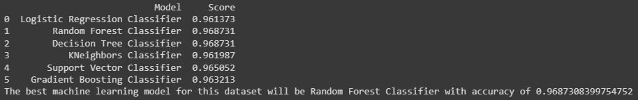

# Covid19-Symptoms-Prediction
Trained more than 5000 data to categorize either the patient is positive in the result of Covid-19 or not.

# Predictive Classification Model by Using Machine Learning Model Random Forest for Covid-19 Symptoms Analysis.
 Using machine learning model to train over 5000 Covid-19 Symptoms Analysis and Prediction dataset to categorize either the person is positive in Covid-19 infection or not.

## Description
1. The project's objective is to predict the Covid-19 infection based on the Covid-19 symptoms according to various World Health Organization (WHO) guidelines.
2. To assess the Covid-19 infection based on the symptoms, various World Health Organization (WHO) guidelines have been measured, which can be used to predict based on these factors.
3. The dataset contains 0 continuous features, 20 categorical features, 1 categorical target and 4968 duplicate data. Although python said that this dataset contains 4968 duplicated rows, it is not justified as the dataset only have 2 categorical features, Yes and No for each of the featured columns and no key ID to differentiate each of the rows. There are also 0 Null values based on the dataset descriptions from the link in the credit section below.
4. The features selected from the dataset are only Breathing_Problem, Fever, Dry_Cough, Sore_throat, Hyper_Tension, Abroad_travel, Contact_with_COVID_Patient, Attended_Large_Gathering, Visited_Public_Exposed_Places, Family_working_in_Public_Exposed_Places since they have better percentage correlation (>0.1) to the target ('COVID-19'), which is output.
5. By using looping method to compare between Logistic Regression, Random Forest, Decision Tree, KNeigbors, SVC & Gradient Boosting for classifier, the machine learning model used that give the highest accuracy is Random Forest Classifier.
6. Methods that can be used to improve the model such as increasing the amount of data to be train and putting key ID to differentiate the rows, so duplicated data can be removed.

### Machine learning model link
[sklearn.ensemble.RandomForestClassifier](https://scikit-learn.org/stable/modules/generated/sklearn.ensemble.RandomForestClassifier.html)

## Results

### Model score:

## Discussion
1. The Random Forest Classifier model achieved 96.9% accuracy during model testing. 
2. Precision score are 98% and 91%, recall score are 98% and 93% and f1 score report are 98% and 97% for output 'Positive' and 'Negative' respectively. 
3. The machine learning model is deployed by using the streamlit apps. Please access thru this link: 
[Prediction of Covid-19 Based on Symptoms](https://safwanshamsir99-covid19-symptoms-prediction-covid-app-j1q4wz.streamlit.app/)

## Credits:
Shout out to Hemanth Harikrishnan from Kaggle for the Symptoms and COVID Presence Dataset. Check out the dataset by clicking the link below. :smile:
### Dataset link
[Symptoms and COVID Presence Dataset](https://www.kaggle.com/datasets/hemanthhari/symptoms-and-covid-presence)
